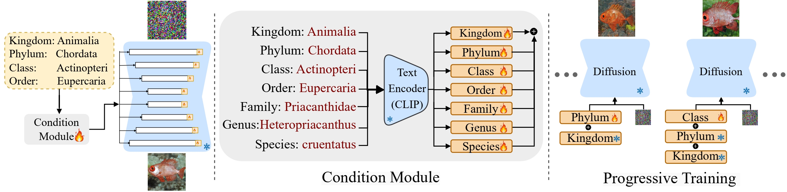

# 🐟 TaxaDiffusion: Progressively Trained Diffusion Model for Fine-Grained Species Generation

<div class="header-content" style="text-align: center; margin-top: 2rem;">
  <h1 style="font-weight: bold; font-family: sans-serif; font-size: 2.8rem; line-height: 1.2;">
    <span style="color:red">T</span>
    <span style="color:orange">a</span>
    <span style="color:gold">x</span>
    <span style="color:green">a</span>
    <span style="color:cyan">D</span>
    <span style="color:blue">i</span>
    <span style="color:indigo">f</span>
    <span style="color:violet">f</span>
    <span style="color:deeppink">u</span>
    <span style="color:orangered">s</span>
    <span style="color:darkorange">i</span>
    <span style="color:mediumseagreen">o</span>
    <span style="color:dodgerblue">n</span>
  </h1>

  <p style="font-size: 1.2rem; font-weight: 500; margin-top: 0.5rem;">
    Progressively Trained Diffusion Model for Fine-Grained Species Generation
  </p>

  <p style="font-size: 1rem; line-height: 1.6; max-width: 800px; margin: 1rem auto;">
    <strong>Authors:</strong><br>
    <a href="https://7amin.github.io/" target="_blank">Amin Karimi Monsefi</a><sup>1</sup>, 
    <a href="https://mridulk97.github.io/" target="_blank">Mridul Khurana</a><sup>2</sup>, 
    <a href="https://cse.osu.edu/people/ramnath.6" target="_blank">Rajiv Ramnath</a><sup>1</sup>, 
    <a href="https://anujkarpatne.github.io/" target="_blank">Anuj Karpatne</a><sup>2</sup>, 
    <a href="https://sites.google.com/view/wei-lun-harry-chao/home" target="_blank">Wei-Lun Chao</a><sup>1</sup>, 
    <a href="https://czhang0528.github.io/" target="_blank">Cheng Zhang</a><sup>3</sup><br>
    <em><sup>1</sup>The Ohio State University, <sup>2</sup>Virginia Tech, <sup>3</sup>Texas A&amp;M University</em>
  </p>
</div>


[](https://amink8.github.io/TaxaDiffusion/)
[](https://arxiv.org/pdf/2506.01923)

---

## 🧑‍💻 Authors

**Amin Karimi Monsefi**, **Mridul Khurana**, **Rajiv Ramnath**, **Anuj Karpatne**, **Wei-Lun Chao**, **Cheng Zhang**

---

## ✨ Highlights

**TaxaDiffusion** introduces a progressive training strategy for fine-grained species generation using diffusion models. We incorporate taxonomic hierarchies to guide generation and improve fidelity at each biological level (Order → Family → Genus → Species).

**Key contributions:**
- Progressive taxonomy-aware generation.
- Stage-wise diffusion training from coarse to fine labels.
- Evaluation on **FishNet**, **BIOSCAN-1M**, and **iNaturalist** datasets.
- Outperforms SOTA baselines in both image quality (FID, LPIPS) and text-image alignment (BioCLIP).


*Progressive training from high-level taxonomy to fine-grained species generation.*

---

## 📦 Installation

Clone the repository and set up the environment:

```bash
git clone https://github.com/aminK8/TaxaDiffusion.git
cd TaxaDiffusion

conda env create -f environment.yml
conda activate taxa_diffusion
```


## Train


```bash
bash job_training.sh
```

## Inference

```bash
bash job_inference.sh
```

## Citation
If you liked our paper, please consider citing it
```bibtex
@misc{monsefi2025taxadiffusionprogressivelytraineddiffusion,
      title={TaxaDiffusion: Progressively Trained Diffusion Model for Fine-Grained Species Generation}, 
      author={Amin Karimi Monsefi and Mridul Khurana and Rajiv Ramnath and Anuj Karpatne and Wei-Lun Chao and Cheng Zhang},
      year={2025},
      eprint={2506.01923},
      archivePrefix={arXiv},
      primaryClass={cs.CV},
      url={https://arxiv.org/abs/2506.01923}, 
}
```
