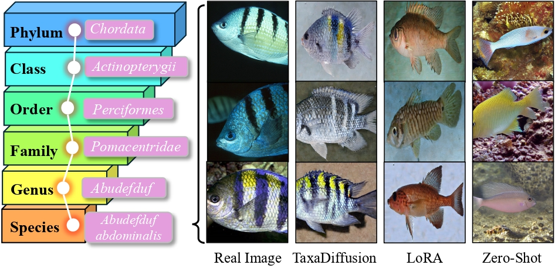
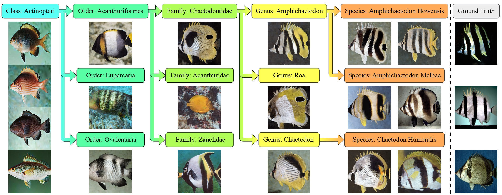

# 🐟 TaxaDiffusion: Progressively Trained Diffusion Model for Fine-Grained Species Generation


[](https://amink8.github.io/TaxaDiffusion/)
[](https://arxiv.org/pdf/2506.01923)

---

## 🧑‍💻 Authors

[**Amin Karimi Monsefi**](https://7amin.github.io/), [**Mridul Khurana**](https://mridulk97.github.io/), [**Rajiv Ramnath**](https://cse.osu.edu/people/ramnath.6), [**Anuj Karpatne**](https://anujkarpatne.github.io/), [**Wei-Lun Chao**](https://sites.google.com/view/wei-lun-harry-chao/home), [**Cheng Zhang**](https://czhang0528.github.io/)

---

## ✨ Highlights

**TaxaDiffusion** is a novel framework that tackles the challenge of generating **fine-grained species-level images** using diffusion models. Biological species often differ by subtle visual traits, making it difficult for standard generative models to capture and preserve these distinctions. To address this, TaxaDiffusion leverages the **hierarchical nature of biological taxonomy** to progressively condition and guide the generation process.


<p align="center">
  
</p>


We propose a **stage-wise training strategy**, where the model is first trained on coarse taxonomic categories (e.g., Class or Order) and is gradually fine-tuned on finer labels (e.g., Genus and Species). This allows the diffusion model to **incrementally learn from general visual semantics to subtle, species-specific cues**.


<p align="center">
  
</p>


**Key contributions:**

- 🧬 **Taxonomy-aware progressive training**: We introduce a novel multi-stage framework that conditions diffusion generation on biological hierarchy, improving structure and diversity.
- 🔁 **Stage-wise refinement of generations**: Each stage refines the model’s output by incorporating finer taxonomic labels, resulting in more accurate and biologically coherent species synthesis.
- 📊 **Comprehensive evaluation on three datasets**:
  - **FishNet** – 17,000+ fish species with high inter-class similarity.
  - **BIOSCAN-1M** – Microscopic images of 8,355 insect species.
  - **iNaturalist** – Diverse set spanning 10,000 plant and animal species.
- 🏆 **State-of-the-art results**:
  - Achieves superior FID and LPIPS scores for image quality.
  - Improves BioCLIP-based alignment between species text labels and generated images.
  - Demonstrates strong generalization across single-group and mixed-species datasets.

  
*Progressive training from high-level taxonomy to fine-grained species generation.*

---

## 📦 Installation

Download the dataset and change the config with the path of the dataset:

```bash
#FishNet Dataset
https://fishnet-2023.github.io/

#BIOSCAN-1M Dataset
https://github.com/bioscan-ml/BIOSCAN-1M

# iNaturalist Dataset
https://www.tensorflow.org/datasets/catalog/i_naturalist2021
```

Clone the repository and set up the environment:

```bash
git clone https://github.com/aminK8/TaxaDiffusion.git
cd TaxaDiffusion

conda env create -f environment.yml
conda activate taxa_diffusion
```


## Train


```bash
bash job_training.sh
```

## Inference

```bash
bash job_inference.sh
```

## Citation
If you liked our paper, please consider citing it
```bibtex
@article{monsefi2025taxadiffusion,
  title={TaxaDiffusion: Progressively Trained Diffusion Model for Fine-Grained Species Generation},
  author={Monsefi, Amin Karimi and Khurana, Mridul and Ramnath, Rajiv and Karpatne, Anuj and Chao, Wei-Lun and Zhang, Cheng},
  journal={arXiv preprint arXiv:2506.01923},
  year={2025}
}
```
